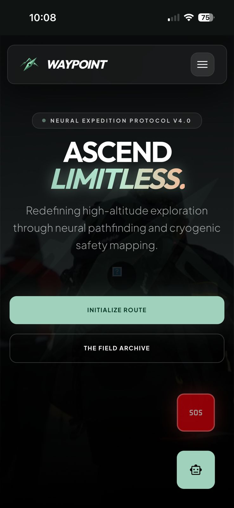
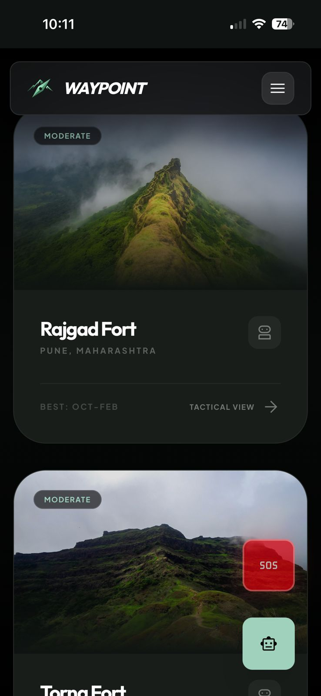
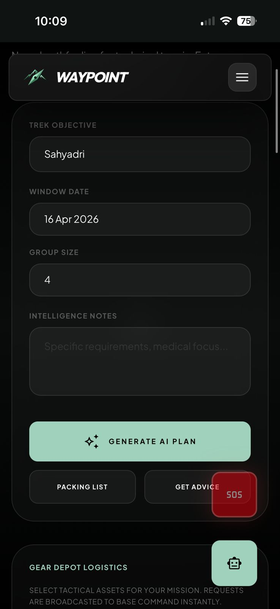
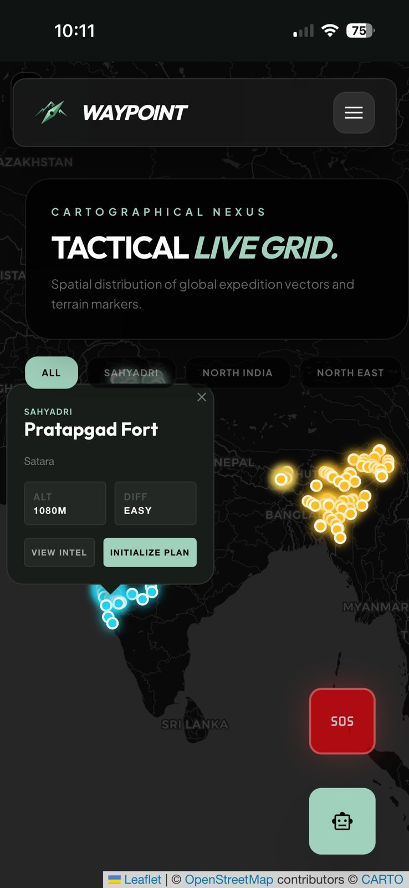
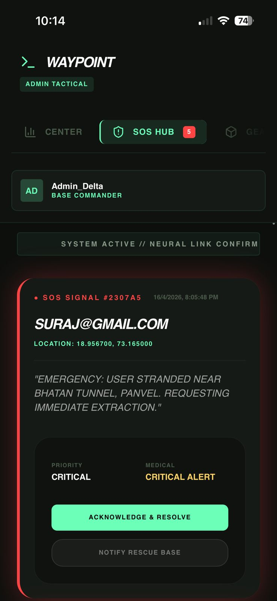

#  🏔️ Waypoint: Neural Expedition Protocol

**Waypoint** is an elite, high-intelligence trekking platform that transforms raw topographical data into actionable mission intelligence.

<p align="center">
  
</p>

---

## ⚡ Intelligence Core
Streamlined topographic rendering and route analysis:

* **LiDAR Mapping**: 0.5m resolution for precise topographic awareness.
* **Neural Pathfinding**: AI route synthesis analyzing 40 years of climate patterns.
* **Offline Grid Sync**: Zero-bandwidth navigation for high-altitude mission safety.
* **Waypoint Sentinel**: Integrated tactical AI assistant (Llama-3.3-70b).

---

## 📡 Tactical Mission Modules

### 1. The Nexus (Discovery)
<p align="center">
  
</p>

### 2. Strategic Planning & Mapping
<p align="center">
  
  &nbsp;&nbsp;&nbsp;&nbsp;&nbsp;&nbsp;&nbsp;&nbsp;&nbsp;&nbsp;
  
</p>

### 3. Command & Control (Admin)
<p align="center">
  
</p>

Centralized oversight for managing expedition data, safety signals, and system parameters.

---

## 🛠️ Tactical Stack
Engineered for maximum field reliability and rapid "Initialization":

* **Frontend**: React 19 + Vite + Tailwind CSS 4.0.
* **Mapping**: Leaflet / React-Leaflet.
* **Infrastructure**: Supabase (Encrypted Database & Auth).
* **Intelligence**: Groq-powered Llama 3 models.

---

## 🚀 Initializing Command
To deploy the local environment and start mission planning:

```bash
# Clone the repository
git clone [https://github.com/oasis-parzival/waypoint-nirman](https://github.com/oasis-parzival/waypoint-nirman)

# Install tactical dependencies
npm install

# Initialize the dev engine
npm run dev
